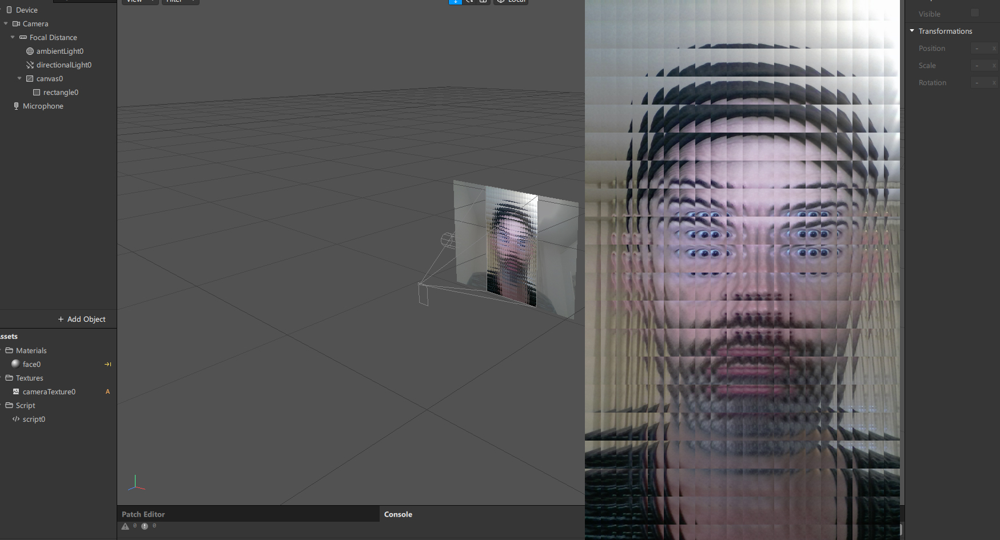

 

# spark-safety-glass-script
> script version of [Josh Beckwith](https://github.com/positlabs) [sparkar-safety-glass](https://github.com/positlabs/spark-safety-glass)

## setup

* install deps `npm i`
* webpack watching `npm run dev`
* webpack build `npm run build`

source: [script](./src/index.js)